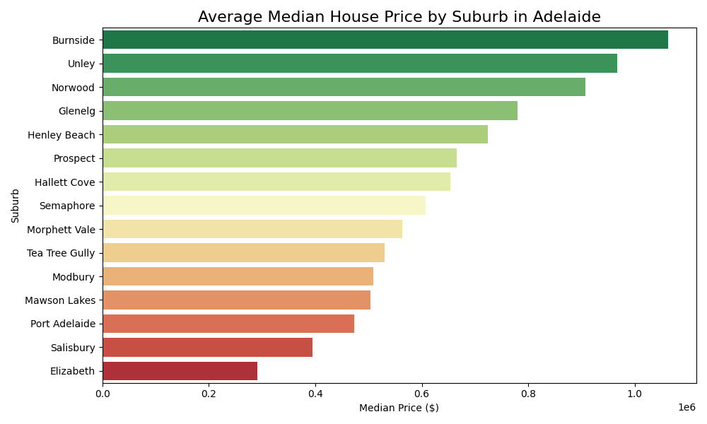
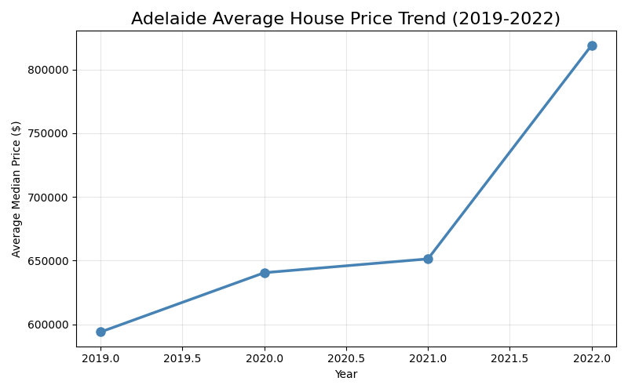
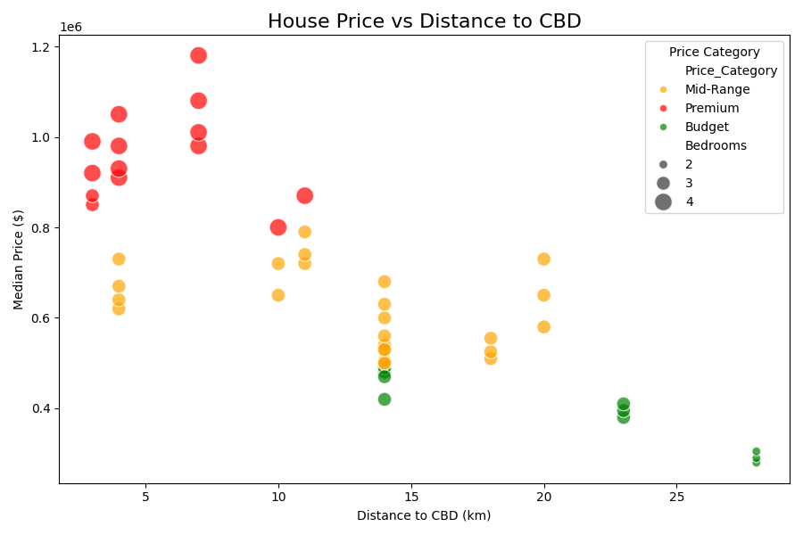
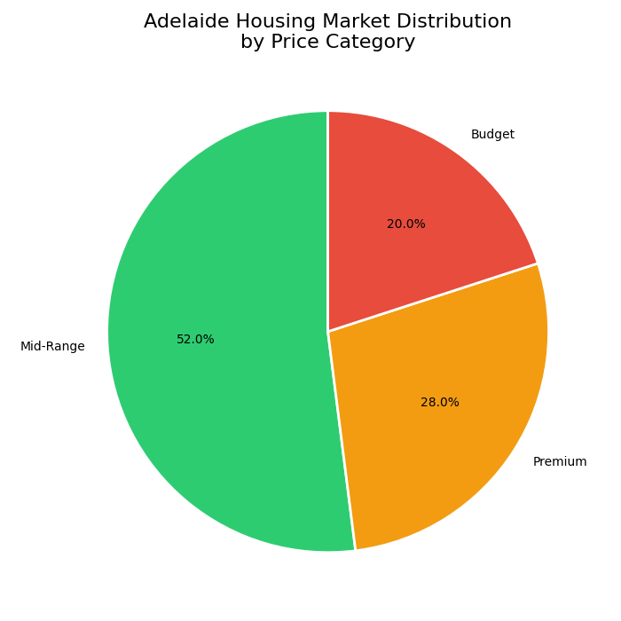
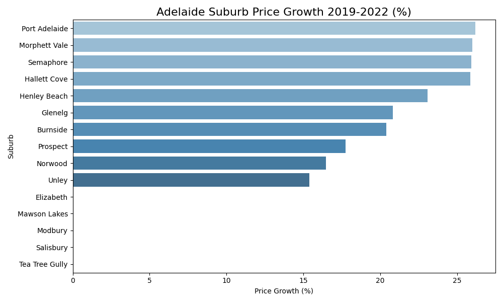

# 🏠 Adelaide Housing Market Analysis

## 📌 Project Overview
This project analyses **Adelaide's suburban housing market** across 15 suburbs 
from 2019 to 2022, uncovering price trends, suburb rankings, and the relationship 
between location and property value.

Built using real Adelaide suburb data including GPS coordinates to produce 
an **interactive map** of housing prices across the city.

---

## ❓ Business Questions Answered
| # | Question | Finding |
|---|----------|---------|
| 1 | Which suburbs are most expensive? | Burnside leads at $1,062,500 |
| 2 | Are prices growing year over year? | Consistent growth 2019–2022 |
| 3 | Does distance to CBD affect price? | Strong negative relationship |
| 4 | How is the market distributed? | Mix of Budget/Mid/Premium |
| 5 | Which suburbs grew fastest? | Inner suburbs grew most |

---

## 🗺️ Interactive Map
An interactive map of Adelaide suburbs colour-coded by price category.
Click any suburb marker to see median price, bedrooms, and distance to CBD.

> 📂 Open `adelaide_housing_map.html` in your browser to explore the map

### Map Legend
| Colour | Category | Price Range |
|--------|----------|-------------|
| 🔴 Red | Premium | > $800,000 |
| 🟠 Orange | Mid-Range | $500K–$800K |
| 🟢 Green | Budget | < $500,000 |

---

## 📊 Key Visualisations

### Suburb Price Comparison

### Price Trend 2019–2022

### Distance to CBD vs Price

### Market Distribution

### Suburb Price Growth

---

## 🔍 Key Insights
- 🏆 **Burnside** is Adelaide's most expensive suburb at $1,062,500 median — 
  nearly **4x more expensive** than Elizabeth at $291,667
- 📈 Adelaide housing prices grew **consistently every year** from 2019 to 2022
- 📍 Suburbs **closer to the CBD** command significantly higher prices — 
  distance is the #1 driver of property value
- 🏘️ Adelaide remains relatively **affordable compared to Sydney/Melbourne** 
  with a healthy mix of budget and mid-range suburbs
- 🚀 Inner suburbs like **Norwood and Burnside** showed the strongest 
  price growth over the 4 year period

---

## 🛠️ Tools & Technologies
- **Python 3** — core programming language
- **pandas** — data cleaning and manipulation
- **matplotlib & seaborn** — static visualisations
- **Folium** — interactive map generation
- **Jupyter Notebook** — analysis environment
- **GitHub** — version control and portfolio hosting

---

## 📁 Project Structure
adelaide-housing-analysis/
│
├── housing_analysis.ipynb          ← Main analysis notebook
├── adelaide_housing_cleaned.csv    ← Cleaned dataset
├── adelaide_housing_map.html       ← Interactive suburb map 🗺️
├── chart1_suburb_prices.png
├── chart2_price_trend.png
├── chart3_distance_vs_price.png
├── chart4_price_distribution.png
└── chart5_price_growth.png
---
## 🗺️ Interactive Map
👉 **[Click here to explore the live interactive Adelaide Housing Map]
(https://rishitpandya22.github.io/-adelaide-housing-analysis/adelaide_housing_map.html)**

> Click any suburb dot to see median price, bedrooms and distance to CBD!

## 👤 Author
**Rishit Pandya**
Master of Data Science Student
Adelaide university, South Australia 🇦🇺

🔗 [GitHub Profile](https://github.com/RishitPandya22)
